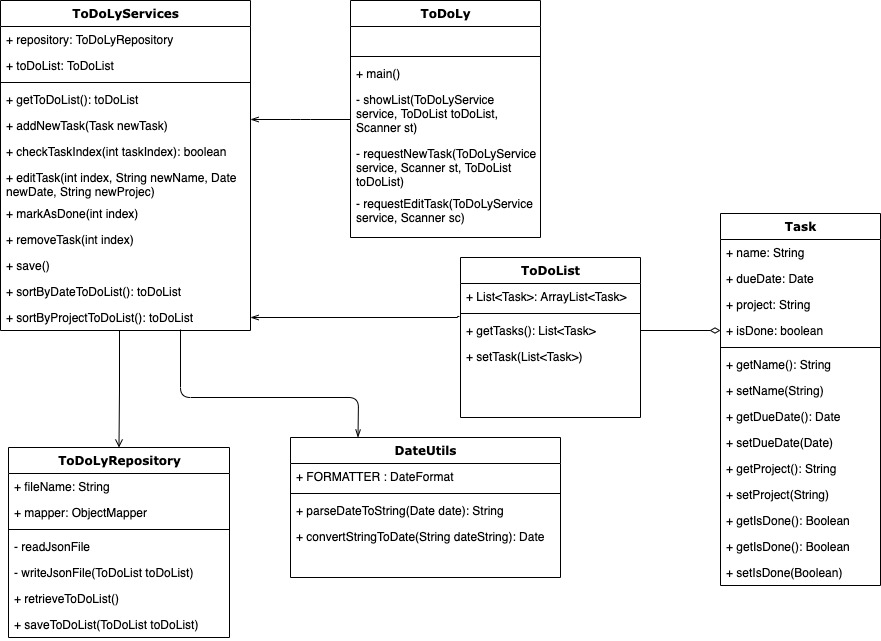

# Individual project - SDA - Novare Potential/KTH

**ToDoLy** is a todo list application. The application allow an user to create new tasks, assign them a title and due date and a project for that task to belong to. ToDoLy use a text based user interface via the command-line. Once they are using the application, the user should be able to also edit, mark as done or remove tasks. They can also quit and save the current task list to file, and then restart the application with the former state restored. 

## Requirements

The solution must achieve the following requirements: Model a task with a task title, due date, status and project Display a collection of tasks that can be sorted both by date and project Support the ability to add, edit, mark as done, and remove tasks Support a text-based user interface Load and save task list to file 

### Class Diagram

Check the class diagram



## MileStones
​
- [x] First draft of project  --- (Mar 9 2020)

- [x] Draft Main class --- (Mar 10 2020)
- [x] Improvement Task class
- [x] Add description of project to README.md 
- [x] Add MVC model (Service)

- [x] Add Feature to write/read file (Repository) --- (Mar 13, 2020 - Mar 14, 2020)
- [x] Add structure for TaskList 


- [x] Refactory ToDoLyRepository class (Mar 14, 2020 - Mar 22, 2020)
- [x] Refactory Model to new structure TodoList and Task 
- [x] Add Feature edit task
- [x] Add solution to "mark as done"

- [x] Add solution to remove task (Mar 23 2020)

- [x] Build Unit Tests to ToDoLyService and ToDoLyRepository classes --- (Mar 24, 2020–Mar 25, 2020)
- [x] Build Javadoc

- [x] Add Feature to sort the To Do list by date or project (Mar 26, 2020)
- [x] Update class diagram 
- [x] Update README.md


## Getting Started

Instructions to run a local copy for development and tests purposes. Deployment notes show how to run the application as a standalone.

### Prerequisites

All dependencies are mentioned in build.gradle

```
Install java 13
```

```
Install gradle 6.1
````

### Installing

To build the project:

```
gradle clean build
```

### To Run the application 

```
gradle run
```

Sample Output:

```
***** Welcome do ToDoLy *****
You have 0 tasks todo and 0 tasks are done!
Pick an option:
(1) Show Task List(by date or project)
(2) Add New Task
(3) Edit Task(update, mark as done, remove)
(4) Save and Quit
```
User can add, edit, remove and save the task in a To Do List choosen an option from the menu.

Sample Output Show Task List:

```
**** ToDoLy - Task List ****
Task number: 0   Task Title: test          Due date: 03/24/2020    Project: groceries      is Done: false
Task number: 1   Task Title: new task         Due date: 03/25/2020    Project: ip sda         is Done: false
```

### Running the tests

To run test:

```
gradle test
```

The test report will be available in {projectRoot}/build/reports/tests/test/index.html

### Deployment

Execute below command to get an executable jar file under project {projectRoot}/build/libs folder

```
gradle clean build
```

Execute below command to execute as java application from {projectRoot}/build/libs location

```
java -jar todoly.jar
```

## Built With

[Gradle](https://gradle.org/) - Dependency Management

[Jackson](https://github.com/FasterXML/jackson) - Json processor for Java 

## Authors

Denise Muniz - Initial work - dendenmuniz
